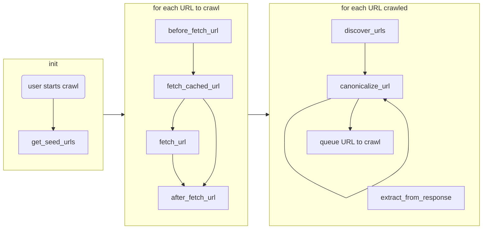

# datasette-scraper

[](https://pypi.org/project/datasette-scraper/)
[](https://github.com/cldellow/datasette-scraper/releases)
[](https://github.com/cldellow/datasette-scraper/actions?query=workflow%3ATest)
[](https://github.com/cldellow/datasette-scraper/blob/main/LICENSE)

`datasette-scraper` is a Datasette plugin to manage small-ish (~100K pages) crawl and extract jobs.

- Opinionated yet extensible
  - Some useful tasks are possible out-of-the-box, or write your own pluggy hooks to go further
- Leans heavily into SQLite
  - Introspect your crawls via ops tables exposed in Datasette
- Built on robust libraries
  - [Datasette](https://datasette.io/) as a host
  - [selectolax](https://github.com/rushter/selectolax) for HTML parsing
  - [httpx](https://www.python-httpx.org/) for HTTP requests
  - [pluggy](https://pluggy.readthedocs.io/en/stable/) for extensibility
  - [zstandard](https://github.com/indygreg/python-zstandard) for efficiently compressing HTTP responses

**Not for adversarial crawling**. Want to crawl a site that blocks bots? You're on your own.

## Installation

Install this plugin in the same environment as Datasette.

    datasette install datasette-scraper

## Usage

Configure `datasette-scraper` via `metadata.json`. You need to enable the plugin
on a per-database level.

To enable it in the `my-database` database, write something like this:

```
{
  "databases": {
    "my-database": {
      "plugins": {
        "datasette-scraper": {
        }
      }
    }
  }
}
```

The next time you start datasette, the plugin will create several tables in
the specified database. Go to the `dss_crawl` table to define a crawl.

A 10-minute end-to-end walkthrough video is available:

<div align="left">
      <a href="https://www.youtube.com/watch?v=zrSGnz7ErNI">
         
      </a>
</div>

## Usage notes

`datasette-scraper` requires a database in which to track its operational data,
and a database in which to store scraped data. They can be the same database.

Both databases will be put into WAL mode.

The ops database's `user_version` pragma will be used to track schema versions.

## Architecture

`datasette-scraper` handles the core bookkeeping for scraping--keeping track of
URLs to be scraped, rate-limiting requests to origins, persisting data into the DB.
It relies on plugins to do almost all the interesting work. For example, fetching
the actual pages, following redirects, navigating sitemaps, extracting data.

The tool comes with plugins for common use cases. Some users may want to author
their own `after_fetch_url` or `extract_from_response` implementations to do custom
processing.

### Overview



### Plugin hooks

Most plugins will only implement a few of these hooks.

- `conn` is a read/write `sqlite3.Connection` to the database
- `config` is the crawl's config

#### `get_seed_urls(config)`

Returns a list of strings representing seed URLs to be fetched.

They will be considered to have depth of 0, i.e. seeds.

#### `before_fetch_url(conn, config, job_id, url, depth, request_headers)`

`request_headers` is a dict, you can modify it to control what gets sent in the request.

Returns:
  - truthy to indicate this URL should not be crawled (for example, crawl max page limit)
  - falsy to express no opinion

> **Note** `before_fetch_url` vs `canonicalize_url`
>
> You can also use the `canonicalize_url` hook to reject URLs prior to them entering
> the crawl queue.
>
> A URL rejected by `canonicalize_url` will not result in an entry in the
> `dss_crawl_queue` and `dss_crawl_queue_history` tables.
>
> Which one you use is a matter of taste, in general, if you _never_ want the URL,
> reject it at canonicalization time.

#### `fetch_cached_url(conn, config, url, depth, request_headers)`

Fetch a previously-cached HTTP response. The system will not have checked that
there was rate limit available before calling this.

Returns:
  - `None`, to indicate not handled
  - a response object, which is a dict with:
    - `fetched_at` - an ISO 8601 time like `2022-12-26 01:23:45.00`
    - `headers` - the response headers, eg `[['content-type', 'text/html']]`
    - `status_code` - the respones code, eg `200`
    - `text` - the response body

Once any plugin has returned a truthy value, no other plugin's `fetch_url`
hook will be invoked.


#### `fetch_url(conn, config, url, request_headers)`

Fetch an HTTP response from the live server. The system will have checked that there
was rate limit available before calling this.

Same return type and behaviour as `fetch_cached_url`.

#### `after_fetch_url(conn, config, url, request_headers, response, fresh, fetch_duration)`

Do something with a fetched URL.

#### `discover_urls(config, url, response)`

Returns a list of URLs to crawl.

The URLs can be either strings, in which case they'll get enqueued as depth + 1, or tuple of URL and depth. This can be useful for paginated index pages, where you'd like to crawl to a max depth of, say, 2, but treat all the index pages as being at depth 1.

#### `canonicalize_url(config, from_url, to_url, to_url_depth)`

Returns:
  - `False` to filter URL
  - an URL to be crawled instead
  - `None` or `True` to no-op

The URL to be crawled can be a string, or a tuple of string and depth.

This hook is useful for:
  - blocking URLs that we never want
  - canonicalizing URLs, for example, by omitting query parameters
  - restricting crawls to same origin
  - resetting depth for pagination

#### `extract_from_response(config, url, response)`

Returns an object of rows-to-be-inserted-or-upserted:

```jsonc
{
  "dbname": {  // can be omitted, in which case, current DB will be used
    "users": [
      {
        "id!": "cldellow@gmail.com",  // ! indicates pkey, compound OK
        "name": "Colin",
      },
      {
        "id!": "santa@northpole.com",
        "name": "Santa Claus",
      }
    ],
    "places": [
      {
        "id@": "santa@northpole.com",
        "__delete": true
      },
      {
        "id@": "cldellow@gmail.com",
        "city": "Kitchener",
      },
      {
        "id@": "cldellow@gmail.com",
        "city": "Dawson Creek"
      }
    ]
  }
}
```

Column names can have sigils at the end:
- `!` says the column is part of the pkey; there can be at most 1 row with this value
- `@` says the column should be indexed; there can be multiple rows with this value

Columns with sigils must be known at table creation time. Although you can have
multiple columns with sigils, you cannot mix `!` and `@` sigils in the same table.

Any missing tables or columns will be created. Columns will have `ANY` data type.
Columns will be nullable unless they have the `!` sigil.

You can indicate that a row should be deleted by emitting `__delete` key in your object.

`datasette-scraper` may commit your changes to the database in batches in order to
reduce write transactions and improve throughput. It may also elide
DELETE/INSERT statements entirely if it determines that the state of the database
would be unchanged.

If you'd like to control the schema more carefully, please create the table manually.

#### Metadata hooks

These hooks don't affect operation of the scrapes. They provide metadata to
help validate a user's configuration and show UI to configure a crawl.

##### config_schema()

Returns a `ConfigSchema` option that defines how this plugin is configured.

Configuration is done via [JSON schema](https://json-schema.org/understanding-json-schema/). UI is done via [JSON Forms](https://jsonforms.io/).

Look at the existing plugins to learn how to use this hook.

The schema is optional; if omitted, you will need to configure the plug in
out of band.

##### config_default_value()

Returns `None` to indicate that new crawls should not use this plugin by default.

Otherwise, returns a reasonable default value that conforms to the schema in `config_schema()`

## Development

To set up this plugin locally, first checkout the code. Then create a new virtual environment:

    cd datasette-scraper
    python3 -m venv venv
    source venv/bin/activate

Now install the dependencies and test dependencies:

    pip install -e '.[test]'

To run the tests:

    pytest
